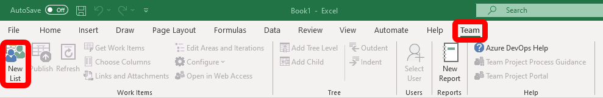

Sometimes it may be a tedious task manually creating work items in Azure DevOps. However, a great way to automatically import work items is by using Excel to first write out the details for PBIs in a spreadsheet, and publish them to the project. 

<!--endintro-->

* First, ensure the Excel Azure DevOps add-in is installed. 
* Open a blank Excel file, then select the ribbon labelled "Team", then click "New List".

* Add the tasks and additional tasks into Release_XX sheet
  

**Note:** The Project Management tasks will be calculated based on your tasks

* Create a new sheet and go to Team tab
* Click "New List" and choose your project
  

  
* Add the other useful columns e.g. Baseline Work, Remaining Work, Completed Work into Excel
  

  
* Copy work items (including the Project Management tasks) from Release_XX to the new sheet
  
* Click "Publish" button to upload the work items to TFS