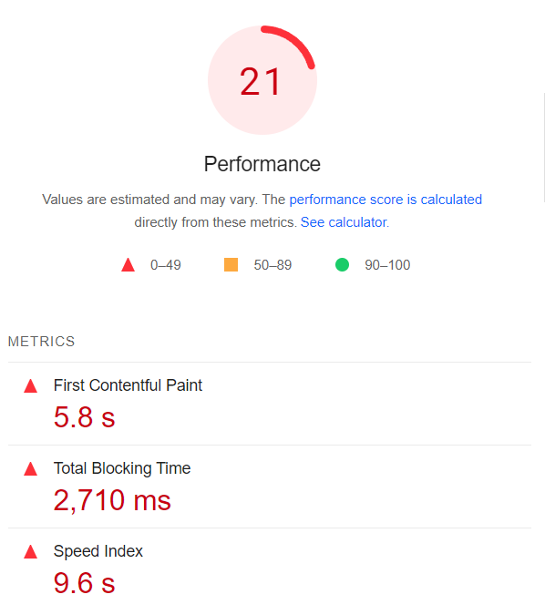
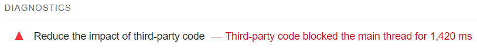
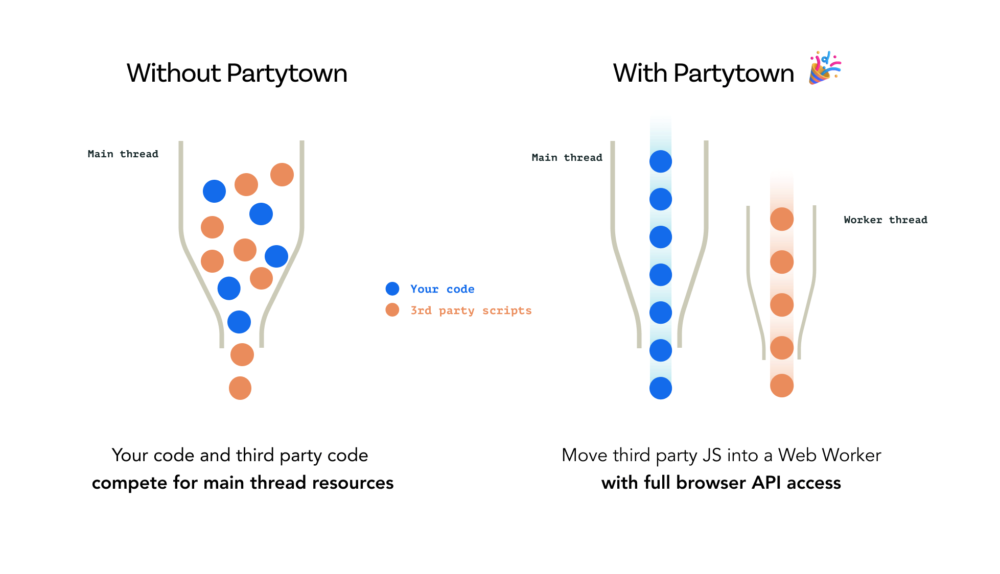

When a website loads a large amount of third party scripts, there can significant performance impacts for the users of the site. This is common with analytics, with some sites needing to load a large amount of third-party analytics scripts such as Google Analytics, Hotjar or Meta Pixel. 

<!--endintro-->

Due to the nature of how JavaScript runs scripts, this means that the code run by these third party scripts will block the main thread of execution, meaning that the important JavaScript required to load the elements of your website will be blocked by these third-party scripts. This can result in an abysmal user experience, and can be quantified by poor [PageSpeed Insights](https://pagespeed.web.dev/) scores. 

::: bad

:::

::: bad

:::

[Partytown](https://partytown.builder.io/) is a lightweight library to help offload third-party scripts off the main JavaScript thread, instead designating these scripts to a [Web Worker](https://developer.mozilla.org/en-US/docs/Web/API/Web_Workers_API/Using_web_workers). Normally, Web Workers are not well-suited for use with analytics scripts as they do not have access to the global `window` variable on the main JavaScript thread, but Partytown fixes this problem.

Partytown is framework-agnostic, and can be used by the vast majority of JavaScript frameworks including Angular, React, Vue, and even vanilla HTML. 

NextJS now has built-in Partytown support in `next/script`, which can be applied by adding the `strategy="worker"` attribute to the `<Script>` tag. Documentation for this feature can be found in the NextJS [official documentation](https://nextjs.org/docs/pages/building-your-application/optimizing/scripts#strategy). 

You can learn more about Partytown at [partytown.builder.io](https://partytown.builder.io/).

**Note:** It is important to keep in mind the [trade-offs](https://partytown.builder.io/trade-offs) and to keep in mind that the tool is still in Beta. There are still many undocumented usecases of the library and it is important to remember to adequately test that the Partytown implementation works with your third-party scripts. 